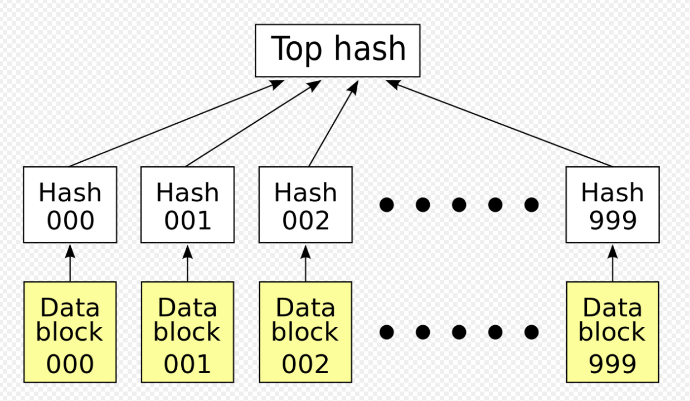

# Python Data Structures

## Sets Tutorial

## Introduction
A set of objects is an unordered data type that you can change but cannot contain duplicate elements. The usefulness of a set once again comes from its performance. While we went over the performance of a list typically being O(n) earlier, a set is only O(1) for most operations. Again, reiterating from earlier, a set is very useful at O(1) instead of O(n) because if the set is gigantic it will be considerably faster as it doesn't scale with the number of items in the set. Its performance is still O(1). 

Python sets are very useful for removing duplicate values, hosting anything where order doesn't matter, and holding values to specific 'bookmarks'. 

By default, sets don't allow duplicate values. If you were to input a duplicate value into a set it would just be removed. Instead of forcing unique constraints on a list or using a for loop to make sure everything in a list is unique, sets do it automatically.

Sets don't hold anything regarding ordering within them. You could input 400 values and a set wouldn't keep their indecies or the order they've been input in. This is important for a situation when you are just dumping data into a set that will be modified later. 

The most commin 'set' in Python would be a dictionary. Sets are very useful with this because values can be tied to a key that can be referenced later. Having unordered values in fine with this because everything is tied to the key anyways. It makes searching for specific values very fast and uses much less memory.

Not many errors happen with sets as they are fairly straightforward but if you are trying to use a set like you would use a list that would definitely cause some issues.

In this tutorial we will go over the basic building and maintaining of sets, internal working of a set, and a few more advanced operations.

## Building Sets

To build a basic set in Python you basically make it like you would make a list but instead of [] you would use {}. This automatically initializes a set on whatever variable you initialize it with.

### {} and set()

```python 
# This is a simple set
# A set is defined by using {}

set1 = {"this", "is", "is", "a", "set"}
print(type(set1))

# Or you can cast it with set()

set2 = set(["this", "is", "is", "a", "set"])
print(type(set2))

```
Output:
<class 'set'>

<class 'set'>

Here you see the two methods to create a set. One uses curly braces {} to define a set and the other one casts a list as a set using set([]). Either one is fine and will have the same result.

Using the same code as earlier, we'll make another set but print the output. You'll see in this output that it automatically removes any duplicates and changes the order of the set a bit.
```python
# A set is defined by using {}

set1 = {"this", "is", "is", "a", "set"}
# Print the set, no order, or duplicates
print(set1)
```

Output: 

{'set', 'a', 'this', 'is'}

As stated above, in this output you can see that the duplicated 'is' was removed and the order was changed around. 

In this next example, we'll go over the add and remove attributes of the set.

### Add and Remove

```python
# We're going to add and remove letters from the set.
# Define the set
alphabet = {'a'}

# Add letters
alphabet.add('b')
alphabet.add('c')
alphabet.add('d')
alphabet.add('e')
alphabet.add('f')
alphabet.add('g')

# Print after adding b-g
print('Set after adding b-g: ')
print(alphabet)

# Remove letters
alphabet.remove('d')
alphabet.remove('e')
print()

# Print after removing d and e
print(f'Set after removing d and e: ')
print(alphabet)
```

Output:

Set after adding b-g: 

{'e', 'b', 'g', 'd', 'f', 'a', 'c'}

Set after removing d and e:

{'b', 'g', 'f', 'a', 'c'}

Now that we have the basics of how to build and maintain a set, we'll go over how the internal structure of the set works and why it's faster than a list.

## Internals of a Set

The inside of a set is called a 'hash table' you might be familiar with hash tables from other languages or statistics/math so if so, skip this. If not, this will be an important thing to learn and understand as you build your own sets.

In a Python list you can search two different ways. Way 1 is using an index. This is extremely fast as the computer knows exactly where to go. However, searching by value is a bit trickier. That's where the big O notation goes into O(n) instead of O(1). With a set, because the values are unique, a computer can just search for the value using a hash function. The hash function maps an undetermined langth data string into a fixed size of data. In other words, it makes a longer data string shorter and more accessible to the computer. 

### Diagram of a Hash List



This hash list allows a computer to know exactly what hash a string of data sits on. Therefore using a performance of O(1).

## Operations of a Set

We went through the basics of a set earlier and now we'll go over some of the more advanced operations.

### Clear

Using set.clear()

```python
# We're going to add and remove letters from the set.
# Define the set
alphabet = {'a'}

# Add letters
alphabet.add('b')
alphabet.add('c')
alphabet.add('d')
alphabet.add('e')
alphabet.add('f')
alphabet.add('g')

# Clear the set
alphabet.clear()

# Print after clearing the set
print('Set after clearing: ')
print(alphabet)

```

Output:

Set after clearing: 

set()

As you can see from the output, set.clear() clears any item in the set but keeps the definition of set itself. Even though we cleared 
'alphabet' you can see it still defined as a set, it's just empty.

### Union

With a set there are two ways to use the union function.

Way one: use 'union()'

Way twp: use '|' (If you can't find this on your keyboard is is the secondary key above enter.)

Both of these union functions do the exact same thing and join two sets together.

```python
# Initialize and build the first set
good_characters = {'Harry Potter', 'Hermione Granger', 'Ron Weasley'}

# Print the unioned set
print('Good characters in Harry Potter: ')
print(good_characters)
print()

# Initialize and build the second set
bad_characters = {'Voldemort', 'Bellatrix Lestrange', 'Dolores Umbridge'}

# Print the unioned set
print('Bad characters in Harry Potter: ')
print(bad_characters)
print()


# Using union() to union them
characters = good_characters.union(bad_characters)

# Print the unioned set
print('Characters in Harry Potter using union(): ')
print(characters)
print()


# Clearing the characters set
characters.clear()
print(f'Chracters cleared: ')
print(characters)
print()

# Using | to union them
characters = good_characters|bad_characters
print(f'Characters in Harry Potter using |: ')
print(characters)
```
Output:

Good characters in Harry Potter: 

{'Harry Potter', 'Ron Weasley', 'Hermione Granger'}

Bad characters in Harry Potter: 

{'Dolores Umbridge', 'Bellatrix Lestrange', 'Voldemort'}

Characters in Harry Potter using union(): 

{'Harry Potter', 'Ron Weasley', 'Dolores Umbridge', 'Hermione Granger', 'Bellatrix Lestrange', 'Voldemort'}

Chracters cleared: 

set()

Characters in Harry Potter using |: 

{'Harry Potter', 'Ron Weasley', 'Dolores Umbridge', 'Hermione Granger', 'Bellatrix Lestrange', 'Voldemort'}

In this example you can see union is used two different ways to achieve the same result. Both are acceptable and while I prefer using union() as it is easier for me to see, it doesn't matter.

### Intersection

Using the intersection function is easy. You simply place one set into the other set with set1.intersection(set2) or 'set1 & set2' and the values that match between the two sets come out. This demo will be faster as it's easy to understand. You can also use the intersection function to build another set.

```python

# Initialize and build the first set
first_set = {1,2,3,4,5,6,7}

second_set = {5,6,7,8,9,10}

# Should return matching values from both sets
print(first_set.intersection(second_set))

print(first_set & second_set)

third_set = first_set.intersection(second_set)

print(third_set)

```

Output:

{5, 6, 7}

{5, 6, 7}

{5, 6, 7}

As you can see from this output, the intesection, which is on 5,6,7 is released every time. This function is really useful if you're looking for quick common values between two sets of data.

### Difference

Just like the intersection function, the difference function is very easy to use. It's practically the opposite of the intersection function. To use it, simply put one set into the other set using .difference() or the '-' operator. 
Ex. set1.difference(set2) or 'set1 - set2'

```python

first_set = {1,2,3,4,5,6,7}

second_set = {5,6,7,8,9,10}

# Should return the values that are in the first set but not in the second
print(first_set.difference(second_set))

# Should return the values that are in the second set but not in the first
print(second_set - first_set)

# Defines third_set as the difference between the first and second sets
third_set = first_set.difference(second_set)

print(third_set)

```

Output: 

{1, 2, 3, 4}

{8, 9, 10}

{1, 2, 3, 4}

As you can see from this example, the differnce function basically takes the numbers that are in the first set but not in the second and returns them.

## Problem to Solve: Difference and Intersection

Write a program that edits the Python code below to not have any intersections with the set.remove() function. You may not change any lines above the comment that says, 'You may not change any code above this line.'

```python

# First set definition
first_set = {1,2,3,4,5,6,7}

# Second set definition
second_set = {5,6,7,8,9,10}

# DO NOT MODIFY CODE ABOVE THIS LINE

# Write your code below


# Printing intersection
print(first_set.intersection(second_set))

```

Write a program that edits the Python code below to not have any differences with the set.add() function. You may not change any lines above the comment that says, 'You may not change any code above this line.'

```python

# First set definition
first_set = {1,2,3,4,5,6,7}

# Second set definition
second_set = {5,6,7,8,9,10}

# DO NOT MODIFY CODE ABOVE THIS LINE

# Write your code below


# Printing intersection
print(first_set.difference(second_set))

```

Try your best to work through the solution before looking at it below. Everything in this problem has been covered above so if you get stuck try reading through the material again first.

- [Solution](2-solution.py)

- [Back to Welcome Page](intro.md)