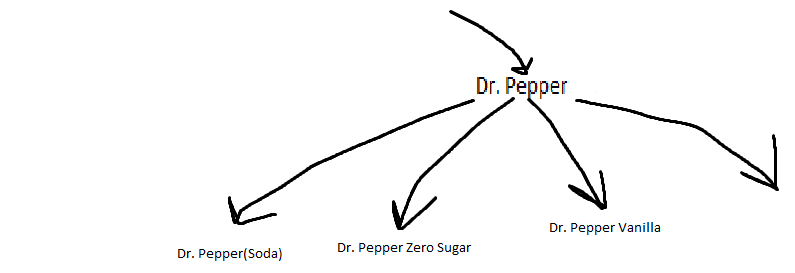
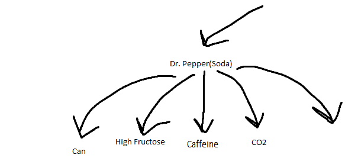
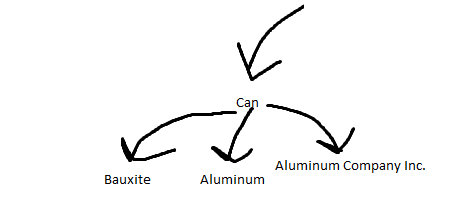
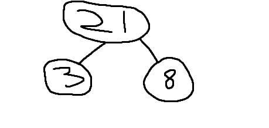
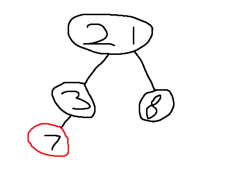

# Python Data Structures

## Sets Tutorial

## Introduction
Trees are just linked lists connected together by pointers. Trees are especially useful for tying values to specific data. It's much easier to see an example of a tree rather than explaining it. So, for an example we'll use a company that distributes soda. The example used is not the tree we will be building today. It is merely an example to give you a feel for trees and how they function.

### Tree Example Pt. 1: Root with Children
At the top you'd have the company. Let's use Dr. Pepper. Dr. Pepper makes the following sodas, 'Dr. Pepper', 'Dr. Pepper Zero Sugar', 'Dr. Pepper Vanilla'... and others. So you'd have a parents tree containing Dr. Pepper the company with branches leading down to each different soda. 


### Tree Example Pt. 2: Children with Children
After having the sodas in the tree we'll include the ingredients and things need to build an item like soda. This allows us to see what is included in each soda by traveling through it's tree. Creating an API to call trees is very quick and uses few resources for the task. We'll use the Dr. Pepper(soda) child node and expand on it to build more child nodes. From Dr. Pepper(soda) you can see that it needs the can, high fructose corn syrup, caffeine, CO2,... and other ingredients.



### Tree Example Pt. 3: Children with Children Again
This is as far as we'll go with this example but it could go on forever. If you're familiar with databases, trees can be built similarly. In each layer of the tree you want the values to correspond to each other. For example, in the following picture, this is poor use of trees. The first two nodes are materials and the third is just the company that the can comes from. This is difficult to understand and complicates the tree. 



Now that you understand the basics of trees and how they function/ good use cases, we'll go over how to the most common tree, Binary Search Tree, how to insert into a Binary Search Tree, and how to explore/use one.


## Binary Search Tree

A binary search tree follows rules based on the data inserted to the tree. When data is placed into the tree it is compared with the data in its parent node. If the data is greater than the parent node it goes to the right branch. If it's less, it goes to the left branch. 



Using this example can you find where a value of 7 would go?



Due to this structure, data is housed in an O(log n) performance. That means that it would outperform both of our earlier structures in terms of speed and execution time. The performance is the big reason binary search trees are so useful.

## Building a Binary Search Tree

Binary Search Trees are the hardest things we'll go over in this tutorial because it uses recursion for correcting values. It is recommended to understand basic recursion before continuing but there will be a brief synopsis added below. 

* Recursion is the process of defining soemthing in terms of itself. In Python, recursion is used when you call a function within itself. This article from Programiz does a great job of explaining it. 


The code to insert into a Binary Search Tree is as follows. In this code, insert is treated as a fucntion so that whenever that function is called the data in parathesis will be the data input into the tree. If you were to hardcode a tree it would be even more confusing than the hardcoded set we saw earlier.

```python 
def insert(self, data):
	"""
	Insert 'data' into the BST.  If the BST
	is empty, then set the root equal to the new 
	node.  Otherwise, use _insert to recursively
	find the location to insert.
	"""
	if self.root is None:
		self.root = BST.Node(data)
	else:
		self._insert(data, self.root)  # Start at the root

def _insert(self, data, node):
	"""
	This function will look for a place to insert a node
	with 'data' inside of it.  The current subtree is
	represented by 'node'.  This function is intended to be
	called the first time by the insert function.
	"""
	if data < node.data:
		# The data belongs on the left side.
		if node.left is None:
			# We found an empty spot
			node.left = BST.Node(data)
		else:
			# Need to keep looking.  Call _insert
			# recursively on the left subtree.
			self._insert(data, node.left)
	elif data >= node.data:
		# The data belongs on the right side.
		if node.right is None:
			# We found an empty spot
			node.right = BST.Node(data)
		else:
			# Need to keep looking.  Call _insert
			# recursively on the right subtree.
			self._insert(data, node.right)
```

This code does not have an output as this is just the base function used to insert into a tree. Luckily, we live in a world where other developers who are further along have sometimes solved your problems for you. Instead of having to implement our own insert, remove, and such functions, people have already developed them for us. It is important we understand the base of recursion in trees so that we can perform maintenance on them if a future job requires but we don't have to build our own right now, we just need to understand them.

We'll be using an import called binarytree for the tree building today.


### 1st Way of Building a Tree

```python
import binarytree

from binarytree import Node
root = Node(6)
root.left = Node(9)
root.right = Node(12)

# Printing the tree
print('Binary tree :', root)
print()
# List of nodes
print('List of nodes :', list(root))
print()
# Nodes left to right
print('Inorder of nodes :', root.inorder)
print()
# Size and Height of BST
print('Size of tree :', root.size)
print('Height of tree :', root.height)

```

Output:

Binary tree : 
  6
 / \
9   12


List of nodes : [Node(6), Node(9), Node(12)]

Inorder of nodes : [Node(9), Node(6), Node(12)]

Size of tree : 3
Height of tree : 1

In this example, a tree is built using predetermined nodes and sides. This isn't the most effective way to build a tree but it's fast if you need it quickly. This also allows you to build trees that aren't true Binary Search Trees so you could also build something that isn't quite O(log n) effeciency. 


### Second Way of Building a Tree

```python
import binarytree

# Import the build function
from binarytree import build

# Build tree from a list

# List
nodes = [2,4,6,8,None,10,14]

# Building the tree from the nodes
binary_tree = build(nodes)

# Show the binary tree that was built
print('Binary tree from list :\n',
      binary_tree)
  
  
# Return the list of nodes again
print('\nList from binary tree :', 
      binary_tree.values)
```

Output:

Binary tree from list :
 
    2___
   /    \
  4     _6
 /     /  \
8     10   14


List from binary tree : [2, 4, 6, 8, None, 10, 14]

In this example, a tree is built off of a list. This is a much easier way to build trees and stops some human error along the way.


### Operations of a Binary Search Tree in Binarytree

The following code executes operations from Binarytree in which a tree can be created and nodes can be indexed, replaced, appended, and deleted.

```python
# Import the Node class
from binarytree import Node

root = Node(1)                  # index: 0, value: 1
root.left = Node(2)             # index: 1, value: 2
root.right = Node(3)            # index: 2, value: 3
root.left.right = Node(4)       # index: 4, value: 4
root.left.right.left = Node(5)  # index: 9, value: 5

# Print the tree
print(root)
print()

# Print a specific node according to index
print(root[2])
print()

# Print the tree + the index
root.pprint(index=True)
print()

# Replace a specific node according to index
root[4] = Node(6, left=Node(7), right=Node(8))
root.pprint(index=True)
print()

# Delete a node according to index
del root[4]
root.pprint(index=True)
print()
```
Output:
Base tree:
  ____1
 /     \
2__     3
   \
    4
   /
  5


Index 2:
3


Tree 2 (Printed tree with index values):

   _________0-1_
  /             \
1-2_____        2-3
        \
       _4-4
      /
    9-5


Tree 3 (Changed 6th node and appended two values):

   ______________0-1_
  /                  \
1-2_____             2-3
        \
       _4-6_
      /     \
    9-7     10-8


Tree 4 (No 6th Node):

   _0-1_
  /     \
1-2     2-3

As you can see from prints 2-4 the first change to the base tree was printing the index values (first number is the value, second number is the index). The next operation was replacing and appending node 6. Then, the last operation was deleting the 6th node entirely.

## Problem to Solve: Building the Binary Tree

Write a program that creates a binary tree with a height of 4. Build this binary tree with the first way of building a binary tree. This will show that you understand what binary trees are and how they are defined/ used. After building the tree, change two values in the tree and delete one to show you understand how to update and delete values.

Try your best to work through the solution before looking at it below. Everything in this problem has been covered above so if you get stuck try reading through the material again first.

- [Solution](3-solution.py)

- [Back to Welcome Page](1-1-Introduction.md)